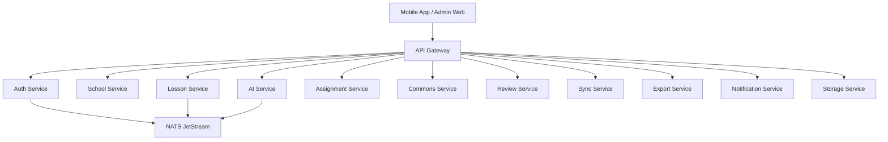

# AetherLearn

**The classroom voice for every learner.**

AetherLearn is a Python 3.12+ microservices backend for a mobile-first inclusive
learning platform. Teachers capture classroom material, then the backend
produces a Teacher Pack, Student Access Pack, and an honest Gemma Trace.

Core principle: **Classroom for trust. Commons for opportunity.**

## Stack

- FastAPI for every HTTP service
- Pydantic v2 schemas
- PyMongo async via `pymongo.asynchronous.AsyncMongoClient`
- NATS JetStream via `nats.py`
- Redis for gateway rate-limit support
- MinIO/S3-compatible storage interfaces
- SQLite reference layer for low-connectivity client cache and sync queue
- `uv` workspace, Ruff, mypy, pytest, pytest-asyncio

## Architecture



Each service owns a separate MongoDB database. Services communicate through
HTTP APIs signed with HMAC service authentication, or through NATS events.
Public clients only call the API Gateway.

## Local Setup

```bash
uv sync
uv run ruff check .
uv run pytest
uv run python scripts/create_indexes.py
uv run python scripts/seed.py
```

Run individual services:

```bash
uv run uvicorn apps.api_gateway.app.main:app --host 0.0.0.0 --port 8000
uv run uvicorn apps.auth_service.app.main:app --host 0.0.0.0 --port 8001
uv run uvicorn apps.school_service.app.main:app --host 0.0.0.0 --port 8002
```

## Docker

```bash
docker compose -f infra/docker-compose.yml up --build
docker compose -f infra/docker-compose.school-hub.yml up --build
```

Service ports:

| Service | Port |
| --- | ---: |
| api-gateway | 8000 |
| auth-service | 8001 |
| school-service | 8002 |
| lesson-service | 8003 |
| ai-service | 8004 |
| assignment-service | 8005 |
| commons-service | 8006 |
| review-service | 8007 |
| sync-service | 8008 |
| export-service | 8009 |
| notification-service | 8010 |
| storage-service | 8011 |

Infrastructure: MongoDB 27017, NATS 4222/8222, Redis 6379, MinIO 9000/9001,
Ollama 11434.

## Demo Accounts

Seed with `SEED_DEMO_DATA=true`.

- `teacher@aetherlearn.demo` / `demo1234`
- `student@aetherlearn.demo` / `demo1234`
- `reviewer@aetherlearn.demo` / `demo1234`
- `admin@aetherlearn.demo` / `demo1234`

## API Gateway

All public responses use:

```json
{ "ok": true, "data": {}, "requestId": "..." }
```

Errors use:

```json
{ "ok": false, "error": { "code": "VALIDATION_ERROR", "message": "...", "details": {} }, "requestId": "..." }
```

Primary route groups:

- `/api/auth/*`
- `/api/teacher/*`
- `/api/student/*`
- `/api/commons/*`
- `/api/review/*`
- `/api/sync/*`
- `/api/export/*`
- `/api/import/*`
- `/api/status`

## AI Runtime Modes

`AI_RUNTIME=auto|gemini|ollama|local-hub|mock`

Mock mode is deterministic and always marks:

- `runtime=mock`
- `localOnly=true`
- `hostedApiUsed=false`
- `fallbackUsed` honestly when fallback occurs

Gemini uses `GEMINI_API_KEY` server-side only. Ollama and school hub modes are
local-only. Runtime fallback is controlled by `ALLOW_RUNTIME_FALLBACK`.

## .kvpack

`.kvpack` is a zip containing:

- `manifest.json`
- `lessonPack.json`
- `traceSummary.json`
- `accessibility.json`
- optional `assets/`
- optional `signature.json`

Raw source images are not included by default. Imports without a signature are
marked unverified.

## Offline Sync

`/api/sync/push` accepts queued mobile operations with `operationId` and
`idempotencyKey`. The sync service returns per-operation results, so one failed
operation does not fail the whole batch. Progress uses true-wins merge.

Low-connectivity clients use SQLite as a local cache and operation queue. The
reference schema and Python implementation live in `packages/offline_sqlite`.
The backend remains authoritative for roles, permissions, assignments, Commons
review, and lesson ownership. `GET /api/sync/status` advertises the supported
SQLite schema version and batch policy.

## Security

- Argon2id password hashing
- JWT access/refresh tokens with refresh rotation
- HMAC service authentication for internal calls
- Signed user context headers for internal authorization
- Roles come from verified access tokens, never the frontend body
- Source images are processed and not stored unless explicit consent is given

## Tests

```bash
uv run ruff check .
uv run ruff format --check .
uv run mypy .
uv run pytest
uv run pytest tests/integration
uv run python scripts/smoke_test.py
```

## Deployment Notes

Use separate secrets per environment. In production, do not leave
`INTERNAL_SERVICE_SECRET`, `JWT_ACCESS_SECRET`, or `JWT_REFRESH_SECRET` as
`change-me`. Expose only the API Gateway publicly; keep internal services on a
private network.
