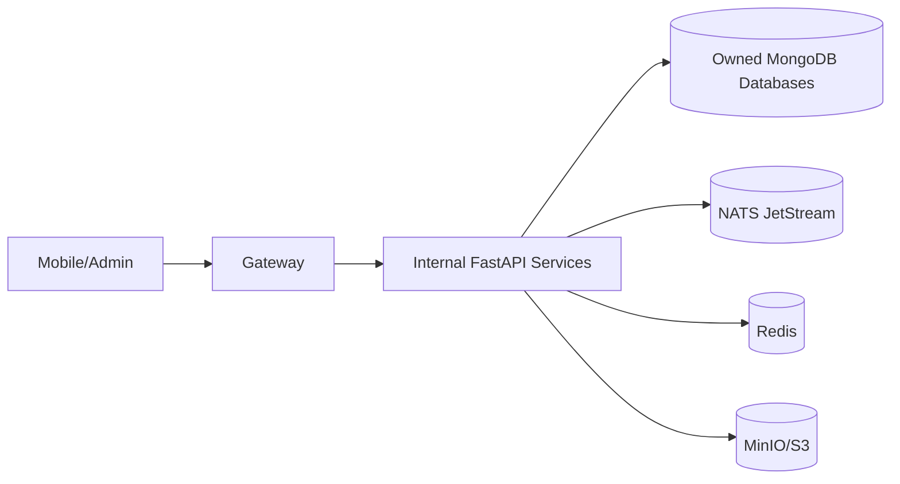

# Architecture

AetherLearn is a Python microservices monorepo. The API Gateway is the only
public entrypoint. Every internal call is signed with HMAC headers and carries a
signed user context when user authorization is needed.

Services never read another service database directly.
