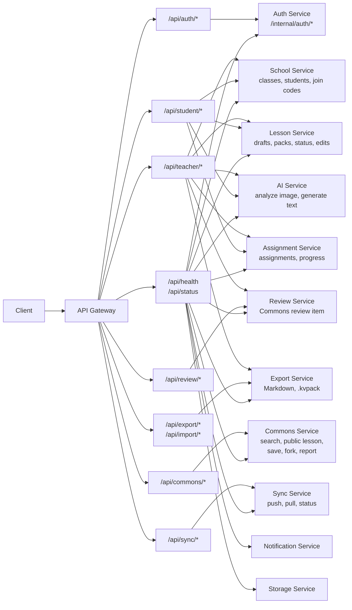
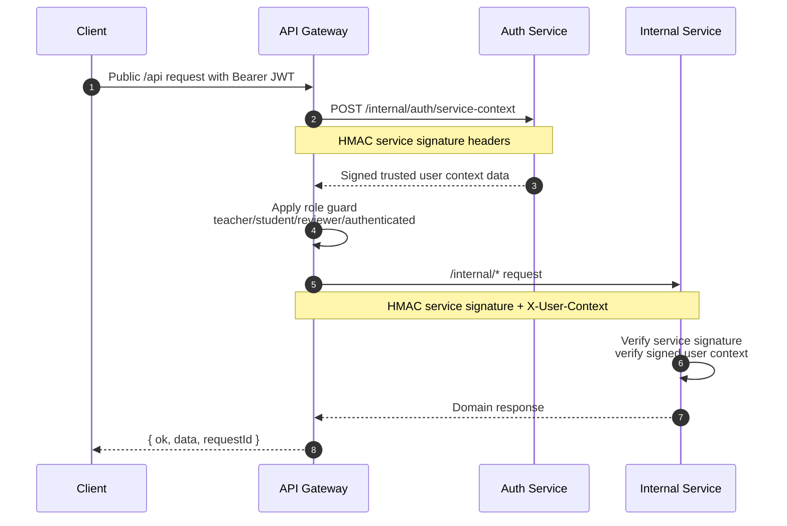
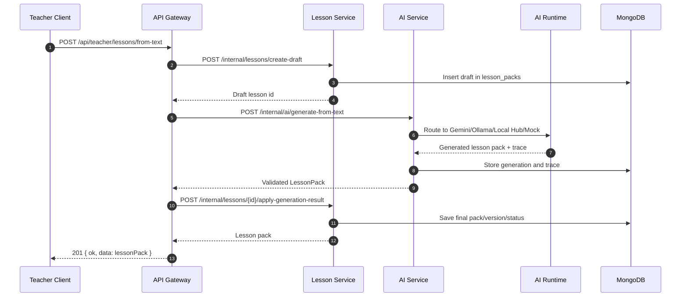
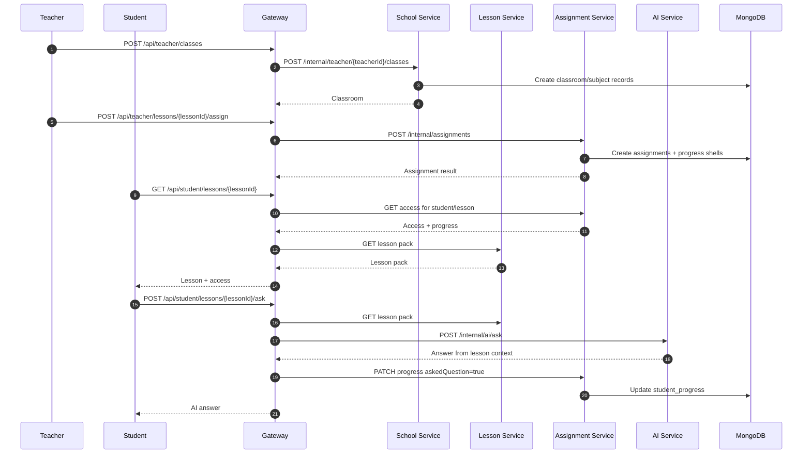
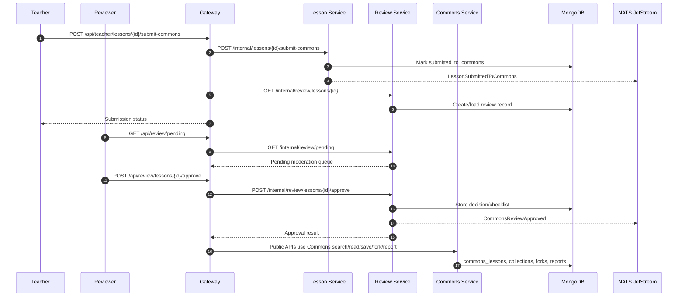
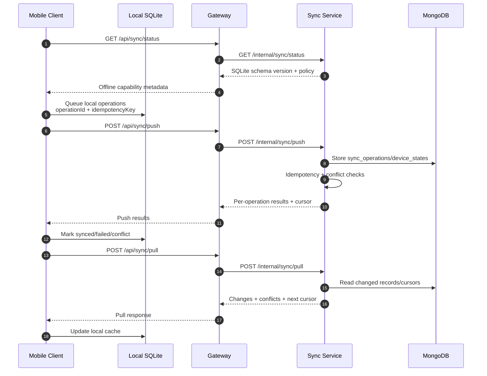
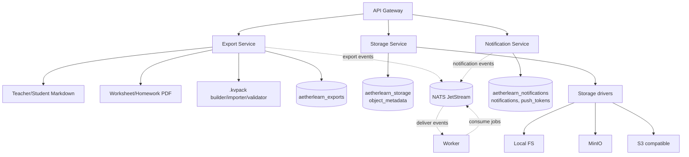
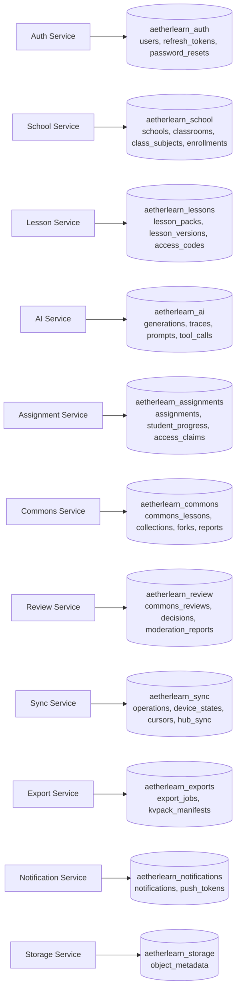

# AetherLearn Backend Flow Diagram

This diagram is based on the current backend code structure: FastAPI API Gateway,
internal service routes, shared auth/signature packages, MongoDB ownership,
NATS event contracts, Redis rate limiting, and MinIO/S3 storage.

## 1. Whole Backend Architecture

```mermaid
flowchart TB
  %% Public clients
  subgraph Clients["Public Clients"]
    Mobile["Mobile App"]
    AdminWeb["Admin / Wired Web UI"]
    OfflineSQLite["Client SQLite Cache + Queue"]
  end

  %% Public edge
  subgraph Edge["Public Edge"]
    Gateway["API Gateway :8000<br/>/api/* routes<br/>JWT verification<br/>role guards<br/>response wrapper"]
    GatewayMiddleware["Gateway Middleware<br/>request id<br/>CORS<br/>rate limit<br/>error normalization"]
  end

  %% Shared packages
  subgraph Shared["Shared Packages"]
    SharedSchemas["shared_schemas<br/>Pydantic contracts"]
    ServiceAuth["service_auth<br/>HMAC service headers<br/>signed user context"]
    SharedUtils["shared_utils<br/>app factory<br/>responses<br/>Mongo repository<br/>request ids"]
    SharedEvents["shared_events<br/>event envelope<br/>subjects<br/>EventBus"]
    OfflinePkg["offline_sqlite<br/>reference schema/store"]
    ApiClient["api_client<br/>gateway client scaffold"]
  end

  %% Internal HTTP services
  subgraph Services["Internal FastAPI Services"]
    Auth["Auth Service :8001<br/>users, passwords, JWTs,<br/>refresh tokens"]
    School["School Service :8002<br/>schools, classrooms,<br/>subjects, enrollments,<br/>join codes"]
    Lesson["Lesson Service :8003<br/>lesson packs, versions,<br/>generation state,<br/>access codes"]
    AI["AI Service :8004<br/>AI runtime router,<br/>prompts, validation,<br/>trace, Q&A"]
    Assignment["Assignment Service :8005<br/>assignments, progress,<br/>lesson access claims"]
    Commons["Commons Service :8006<br/>public lessons, search,<br/>collections, saves,<br/>forks, reports"]
    Review["Review Service :8007<br/>moderation queue,<br/>checklists, decisions,<br/>reports"]
    Sync["Sync Service :8008<br/>offline push/pull,<br/>operation log,<br/>conflict handling"]
    Export["Export Service :8009<br/>Markdown, PDF,<br/>.kvpack import/export"]
    Notify["Notification Service :8010<br/>notifications,<br/>push tokens"]
    Storage["Storage Service :8011<br/>object metadata,<br/>signed URLs,<br/>storage drivers"]
  end

  %% Background
  subgraph Background["Background Processing"]
    Worker["Worker<br/>event consumers<br/>cleanup/index jobs"]
  end

  %% Infrastructure
  subgraph Infra["Infrastructure"]
    Redis[("Redis :6379<br/>gateway rate limit")]
    NATS[("NATS JetStream :4222<br/>AETHERLEARN stream")]
    Mongo[("MongoDB :27017<br/>one database per service")]
    ObjectStore[("MinIO / S3 / Local Storage<br/>objects and assets")]
    AIRuntime["AI Runtime<br/>Gemini / Ollama / Local Hub / Mock"]
  end

  Mobile --> Gateway
  AdminWeb --> Gateway
  OfflineSQLite --> Gateway

  Gateway --> GatewayMiddleware
  GatewayMiddleware --> Auth
  GatewayMiddleware --> School
  GatewayMiddleware --> Lesson
  GatewayMiddleware --> AI
  GatewayMiddleware --> Assignment
  GatewayMiddleware --> Commons
  GatewayMiddleware --> Review
  GatewayMiddleware --> Sync
  GatewayMiddleware --> Export
  GatewayMiddleware --> Notify
  GatewayMiddleware --> Storage

  GatewayMiddleware -. uses .-> Redis
  Gateway -. imports .-> SharedSchemas
  Gateway -. uses .-> ServiceAuth
  Gateway -. uses .-> SharedUtils

  Auth -. uses .-> SharedSchemas
  School -. uses .-> SharedSchemas
  Lesson -. uses .-> SharedSchemas
  AI -. uses .-> SharedSchemas
  Assignment -. uses .-> SharedSchemas
  Commons -. uses .-> SharedSchemas
  Review -. uses .-> SharedSchemas
  Sync -. uses .-> SharedSchemas
  Export -. uses .-> SharedSchemas
  Notify -. uses .-> SharedSchemas
  Storage -. uses .-> SharedSchemas

  Auth --> Mongo
  School --> Mongo
  Lesson --> Mongo
  AI --> Mongo
  Assignment --> Mongo
  Commons --> Mongo
  Review --> Mongo
  Sync --> Mongo
  Export --> Mongo
  Notify --> Mongo
  Storage --> Mongo

  Storage --> ObjectStore
  Export --> ObjectStore
  AI --> AIRuntime

  Auth -. events .-> NATS
  School -. events .-> NATS
  Lesson -. events .-> NATS
  AI -. events .-> NATS
  Assignment -. events .-> NATS
  Commons -. events .-> NATS
  Review -. events .-> NATS
  Sync -. events .-> NATS
  Export -. events .-> NATS
  Notify -. events .-> NATS
  Worker -. publish .-> NATS
  NATS -. deliver .-> Worker

  NATS -. dead letters .-> NATS
  SharedEvents -. defines .-> NATS
  OfflinePkg -. reference .-> OfflineSQLite
  ApiClient -. calls .-> Gateway
```



## 2. Public Route To Internal Service Map



## 3. Request Security Flow



## 4. Teacher Lesson Generation Flow



Image generation uses the same shape, except `/api/teacher/lessons/analyze`
creates the draft and generation request first, then the gateway runs the image
analysis in a background task before applying the AI result to the lesson.

## 5. Class, Assignment, Student Learning, And Q&A Flow



## 6. Commons Review And Publishing Flow



## 7. Offline Sync Flow



## 8. Export, Import, Storage, And Events



## 9. Database Ownership



## 10. One-Line Mental Model

```text
Client -> API Gateway -> signed internal HTTP -> domain service -> owned MongoDB
                  |                      |
                  |                      +-> optional NATS event -> worker/other service
                  +-> normalized { ok, data/error, requestId } response
```
